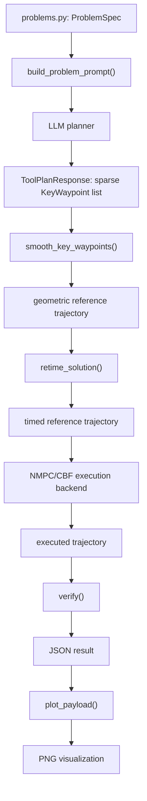

# LLM + NMPC + CBF Crazyflie Mission Planner

This repository implements a research-style pipeline for multi-agent Crazyflie trajectory planning:

1. An LLM proposes sparse mission-level waypoints.
2. The tool smooths those waypoints into a geometric reference trajectory.
3. A time-scaling optimizer assigns timestamps for a requested mission time.
4. An NMPC/CBF execution layer tracks the reference while enforcing safety constraints.
5. A verifier checks mission, safety, dynamic, battery, and timing feasibility.
6. A visualization script plots the problem and generated trajectories.

The main entry point is:

```powershell
python tool_pipeline.py
```

By default, this runs the LLM refinement pipeline on `MA1`, applies retiming, executes the cascade NMPC/CBF backend, verifies the result, and saves JSON/PNG outputs.

## High-Level Data Flow



Reference-only mode skips the LLM and starts from the built-in `recommended_key_waypoints` in `problems.py`.

## Current Problems

Problems are defined in `problems.py`.

| Problem | Purpose | Target Time |
| --- | --- | --- |
| `MA1` | Two-Crazyflie obstacle mission with target visits, battery constraints, and inter-agent separation. | `30.0 s` |
| `MA2` | Single-Crazyflie mission that requires a mid-mission recharge stop to satisfy the battery floor. | `45.0 s` |
| `MA3` | Intentionally time-infeasible mission. Used to test infeasibility reporting. | `8.0 s` |

Each problem contains:

- charging station positions
- obstacle boxes
- target positions
- agent start stations, required targets, and final goals
- velocity, acceleration, jerk, snap, curvature, attitude-rate, battery, and separation limits
- a single requested `target_time`
- built-in `recommended_key_waypoints` for reference-mode testing

Older `target_time_min`, `target_time_max`, `time_limit`, and `cruise_speed` fields are no longer part of the active workflow.

## File Structure and Responsibilities

### `schemas.py`

Defines the shared Pydantic data models.

- `Waypoint`: fully timed trajectory point with `x, y, z, t`.
- `AgentTrajectory`: one drone's list of timed waypoints.
- `MissionSolution`: all agent trajectories.
- `KeyWaypoint`: sparse high-level waypoint from the LLM or reference route. It has position, optional `hold_seconds`, and a note.
- `ToolAgentPlan`: one LLM-planned key-waypoint route for one Crazyflie.
- `ToolPlanResponse`: structured LLM response containing all agent plans and a strategy explanation.
- `ObstacleSpec`: obstacle box.
- `AgentSpec`: start station, required targets, and final goal for each drone.
- `ProblemSpec`: full problem definition and constraints.

The LLM does not output dense timed trajectories. It outputs sparse `KeyWaypoint`s. The rest of the pipeline turns those key waypoints into feasible timed trajectories.

### `problems.py`

Stores all benchmark mission definitions and prompt construction logic.

Important functions:

- `get_problem(problem_id)`: returns a `ProblemSpec`.
- `build_problem_prompt(problem_id)`: converts the selected problem into a prompt for the LLM.

The prompt tells the LLM to choose route geometry, charging stops, obstacle detours, target order, and final routing. It explicitly tells the LLM not to control speed or timestamps because the optimizer assigns timestamps afterward.

### `tool_pipeline.py`

This is the main orchestration file.

Its responsibilities are:

- call the LLM with a structured response model
- smooth sparse key waypoints
- retime the reference trajectory
- execute the selected NMPC/CBF backend
- verify the result
- run the feedback refinement loop
- save JSON outputs
- save plots by calling `visualization.py`

Key functions:

- `run_tool_pipeline(...)`: one full LLM attempt.
- `run_llm_refinement(...)`: repeated LLM attempts with verifier feedback.
- `smooth_key_waypoints(...)`: converts sparse `KeyWaypoint`s into a dense geometric trajectory.
- `build_reference_solution(...)`: builds a retimed trajectory from built-in reference waypoints.
- `save_reference_trajectory(...)`: writes a reference JSON.
- `save_executed_reference_trajectory(...)`: runs NMPC/CBF on the built-in reference trajectory and writes JSON.
- `estimate_required_nmpc_time(...)`: if execution fails, searches for a longer mission time that makes the NMPC-executed trajectory pass.

The default backend is `cascade`, which uses `nmpc_cbf.py`. The optional backend `full` uses `full_motor_nmpc.py`.

### `trajectory_retiming.py`

Implements geometric-path time scaling.

Input:

- a geometric trajectory with fixed positions
- a requested `target_time`
- problem dynamic limits

Output:

- a new trajectory with updated timestamps
- metrics describing feasibility

The optimizer adjusts segment durations `dt`, not the path geometry. It enforces:

- max velocity
- max acceleration
- max jerk
- max snap
- max curvature

The default method is SLSQP. The objective is to find the fastest feasible timing for the fixed geometry. If the fastest feasible timing is shorter than the requested `target_time`, the trajectory is stretched to end exactly at the requested time. If the fastest feasible timing is longer than the requested `target_time`, the result reports infeasibility:

- `feasible_by_requested_time: false`
- `required_mission_time`
- `required_time_increase`
- approximate limit multipliers if the same geometry were time-compressed

This is the part that answers: "Can the reference trajectory be followed within the requested time using the fixed drone limits?"

### `nmpc_cbf.py`

Implements the default cascade NMPC/CBF execution backend.

This is not the full motor-level optimizer. It is a practical cascade model:

1. NMPC computes desired acceleration over a short horizon.
2. CBF modifies the command if obstacle or inter-agent safety constraints are active.
3. A quadrotor-like near-hover dynamics model simulates roll, pitch, thrust, angular rate, and motor thrust response.

Important concepts:

- `NMPCConfig`: horizon length, `dt`, tracking weights, thrust/tilt/jerk/attitude-rate limits.
- `CBFConfig`: obstacle and inter-agent safety barrier settings.
- `DroneState`: simulated state including position, velocity, attitude, thrust, angular velocity, and motor thrusts.
- `ExecutionMetrics`: tracking error and dynamic execution metrics.
- `execute_with_nmpc_cbf(...)`: main function used by the pipeline.

This backend is faster and easier to run than full motor-level NMPC, but it can still fail verification if the executed trajectory creates high curvature, acceleration, jerk, or tracking error.

### `full_motor_nmpc.py`

Implements optional full nonlinear motor-level NMPC with CasADi/IPOPT.

State includes:

- position
- velocity
- Euler attitude
- angular velocity
- four motor thrust states

Control input is four motor thrust commands. The model includes:

- thrust-to-acceleration mapping
- attitude dynamics
- angular-rate dynamics
- motor first-order response
- drag
- CBF-style obstacle and inter-agent safety constraints

Important functions:

- `casadi_available()`: checks whether CasADi is installed.
- `solve_casadi_full_motor_nmpc(...)`: solves one motor-level NMPC problem.
- `execute_with_full_motor_nmpc(...)`: repeatedly solves and applies motor-level NMPC commands over the mission.

Use this backend with:

```powershell
python tool_pipeline.py --problem-id MA1 --nmpc-backend full
```

It is much slower than the cascade backend and requires CasADi.

### `verifier.py`

Checks whether a trajectory satisfies the problem constraints.

It verifies:

- all expected agents are present
- timestamps are strictly increasing
- each drone starts at its assigned charging station
- max velocity
- max acceleration
- max jerk
- max snap
- max curvature
- battery floor and charging behavior
- obstacle avoidance with clearance
- assigned target visits
- final goal reachability
- inter-agent separation
- total mission time against `target_time`

The verifier is also used to generate feedback for LLM refinement.

### `visualization.py`

Plots the problem and trajectory as a 3D PNG.

It draws:

- obstacle boxes
- expanded obstacle clearance boxes
- charging stations
- targets
- final goals
- agent trajectories
- failed obstacle-intersection segments in red when detected from verifier output

Main function:

```powershell
python visualization.py --input llm_refined_trajectory.json
```

The main pipeline calls this automatically unless `--no-plot` is passed.

### `refinement.py`

Legacy helper script for running multiple refinement trials. The newer and preferred path is `run_llm_refinement(...)` inside `tool_pipeline.py`.

## Main Execution Modes

### 1. Default LLM + Retiming + NMPC/CBF

```powershell
python tool_pipeline.py
```

Equivalent behavior:

- problem: `MA1`
- target time: `MA1.target_time`
- LLM planner: enabled
- retiming: enabled
- NMPC/CBF: enabled
- backend: `cascade`
- plot: enabled
- output: `llm_refined_trajectory.json`

Generated files include:

- `llm_refined_trajectory_turn1.json`
- `llm_refined_trajectory_turn1.png`
- later turn files if refinement continues
- `llm_refined_trajectory.json`
- `llm_refined_trajectory.png`

### 2. Run a Specific Problem with LLM

```powershell
python tool_pipeline.py --problem-id MA2 --target-time 45
```

This asks the LLM to plan MA2, retimes the LLM route to 45 seconds, runs NMPC/CBF, verifies, and plots.

### 3. Reference-Only Mode

```powershell
python tool_pipeline.py --reference-only --problem-id MA2 --target-time 45
```

This skips the LLM and uses `recommended_key_waypoints` from `problems.py`.

Generated files:

- `reference_trajectory.json`
- `reference_trajectory.png`

This is useful for debugging retiming and verification without LLM variability.

### 4. Execute the Built-In Reference with NMPC/CBF

```powershell
python tool_pipeline.py --problem-id MA2 --target-time 45 --execute-reference
```

This command:

1. uses the built-in reference waypoints
2. smooths them
3. retimes them to 45 seconds
4. verifies the reference trajectory
5. runs the selected NMPC/CBF backend on that reference
6. verifies the executed trajectory
7. saves both reference and executed plots

Generated files:

- `reference_trajectory.json`
- `reference_trajectory.png`
- `executed_trajectory.json`
- `executed_trajectory.png`

### 5. Estimate Required Mission Time After Execution Failure

```powershell
python tool_pipeline.py --problem-id MA2 --target-time 45 --execute-reference --estimate-required-time
```

This first tries the requested time. If the NMPC-executed trajectory fails verification, it repeatedly tests longer target times and reports:

- requested time
- estimated required mission time
- required time increase

This does not change the physical limits. It answers: "If the drone limits are fixed, how much more mission time is needed?"

### 6. Full Motor-Level NMPC

```powershell
python tool_pipeline.py --problem-id MA1 --nmpc-backend full
```

Optional smoke-test duration:

```powershell
python tool_pipeline.py --problem-id MA1 --nmpc-backend full --full-max-duration 3
```

The full backend is closer to the nonlinear quadrotor model, but it is slower and requires CasADi.

## What the Output JSON Means

A typical output contains:

- `problem_id`: selected mission.
- `strategy`: LLM explanation of its route choice.
- `verification`: pass/fail result and detailed metrics.
- `agent_trajectories`: timed waypoints for each drone.
- `refinement`: turn-by-turn feedback history for LLM refinement outputs.

Inside `verification.details`:

- `agents`: per-agent mission, battery, obstacle, kinematic, and smoothness checks.
- `separation`: inter-agent minimum distance.
- `time`: total mission time and requested target time.
- `retiming`: time-scaling feasibility metrics, if retiming was used.
- `execution_backend`: selected backend name, if NMPC/CBF was used.
- `nmpc_cbf` or `full_motor_nmpc_cbf`: execution metrics from the backend.
- `nmpc_time_feasibility`: required-time estimate, if requested and execution failed.

Important retiming fields:

- `requested_target_time`: requested mission time.
- `feasible_by_requested_time`: whether the fixed geometry can satisfy dynamic limits within that time.
- `required_mission_time`: minimum estimated time needed for that fixed geometry.
- `required_time_increase`: extra seconds needed beyond the requested target time.
- `time_after`: actual final time after retiming.

## Conceptual Role of Each Layer

### LLM Layer

The LLM is responsible for mission reasoning:

- target order
- charging-stop decisions
- obstacle detour choice
- rough altitude strategy
- final routing

The LLM is not trusted to output dynamically feasible timestamps.

### Geometric Smoothing Layer

This layer converts sparse route decisions into a denser continuous-looking path. It reduces sharp waypoint corners using smooth segment interpolation and reshapes vertical target visits to avoid straight-down, straight-up spikes when possible.

### Retiming Layer

This layer assigns timestamps to the fixed geometry. It does not move waypoints. It decides how slowly or quickly each segment should be traversed so that velocity, acceleration, jerk, snap, and curvature constraints are respected.

If the requested time is too short, this layer reports infeasibility instead of increasing drone limits.

### NMPC/CBF Layer

The NMPC layer tracks the retimed reference. The CBF layer acts as a safety filter for obstacles and inter-agent separation.

The cascade backend is faster and suitable for iterative experiments. The full backend is closer to a nonlinear motor-level quadrotor formulation but is computationally heavier.

### Verifier Layer

The verifier is the final judge. It checks the trajectory that actually comes out of the selected pipeline, not only the LLM plan. Its failure reason is fed back into the LLM during refinement.

## Setup Notes

Recommended Python dependencies:

```powershell
pip install numpy scipy matplotlib pydantic instructor openai
```

For full motor-level NMPC:

```powershell
pip install casadi
```

For LLM mode, set an OpenAI API key in your environment before running:

```powershell
$env:OPENAI_API_KEY="your_api_key_here"
```

Reference-only mode does not require an OpenAI API key.

## Practical Debugging Workflow

Start with the reference trajectory:

```powershell
python tool_pipeline.py --reference-only --problem-id MA2 --target-time 45
```

Then execute that reference:

```powershell
python tool_pipeline.py --problem-id MA2 --target-time 45 --execute-reference
```

If execution fails, estimate the required mission time:

```powershell
python tool_pipeline.py --problem-id MA2 --target-time 45 --execute-reference --estimate-required-time
```

Then run the full LLM loop:

```powershell
python tool_pipeline.py --problem-id MA2 --target-time 45
```

This separates three questions:

1. Is the geometric reference itself feasible?
2. Can the NMPC/CBF execution track it within the requested time?
3. Can the LLM improve the route when verifier feedback says it failed?

